# Analytics project that consumes events from kafka and stores in OLAP family Druid DB for analytics. Superset is visualization tool.

An example project that builds analytics with Kafka messages
###### 1. Druid(Steps to be done using Console 1)
Currently Druid with latest version has poor Docker support. I have build tar from the Druid source code. Modified few settings to make it easier to run on the local Machines and done few change to runtime configs.

Download from: https://drive.google.com/open?id=1mP7RZrBOcT6RptWcmP66msIXmf5pfIBb 
1. Unzip apache-druid
2. cd apache-druid
3. run `bin/supervise -c dev/running/conf/demo-cluster.conf`
Once you run, console looks like this.
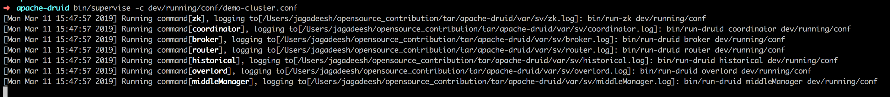
4. open Druid Console	http://localhost:8081/
5. Druid Indexing	http://localhost:8081/console.html
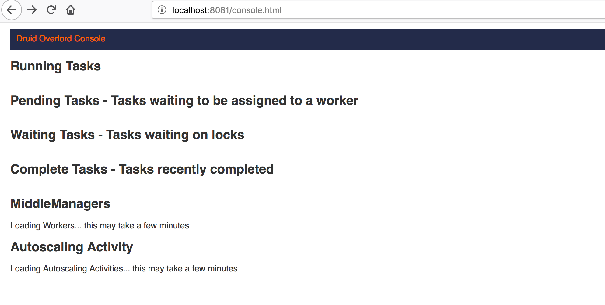
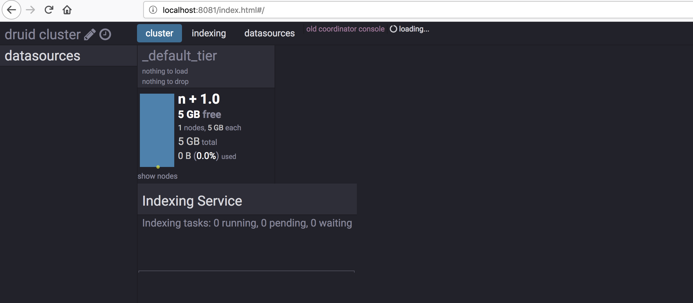

###### Producing events from  Kafka(Steps to be done using Console 2):

###### 2. Create Network
 `docker network create jemstep`
###### 3. Zookper
```
 docker run -d \
    --net=jemstep \
    --name=zookeeper \
    -p 2190:2181 \
    -e ZOOKEEPER_CLIENT_PORT=2190 \
    confluentinc/cp-zookeeper:4.1.0
```
###### 4. Kafka
```
docker run -d \
    --net=jemstep \
    --name=kafka \
    -p 9092:9092 \
    -p 9999:9999 \
    -p 29092:29092 \
    -e KAFKA_ZOOKEEPER_CONNECT=zookeeper:2190 \
    -e KAFKA_LISTENER_SECURITY_PROTOCOL_MAP=PLAINTEXT:PLAINTEXT,PLAINTEXT_HOST:PLAINTEXT \
    -e KAFKA_ADVERTISED_LISTENERS=PLAINTEXT://kafka:9092,PLAINTEXT_HOST://localhost:29092 \
    -e KAFKA_OFFSETS_TOPIC_REPLICATION_FACTOR=1 \
    -e KAFKA_JMX_HOSTNAME=kafka \
    -e KAFKA_JMX_PORT=9999 \
    confluentinc/cp-kafka:4.1.0
```  
###### 5. Schema-Registry:
```
docker run -d \
  --net=jemstep \
  --name=schemaregistry \
  -p 8024:8024 \
  -e SCHEMA_REGISTRY_KAFKASTORE_CONNECTION_URL=zookeeper:2190 \
  -e SCHEMA_REGISTRY_HOST_NAME=schema-registry \
  -e SCHEMA_REGISTRY_LISTENERS=http://0.0.0.0:8024 \
  -e SCHEMA_REGISTRY_ACCESS_CONTROL_ALLOW_METHODS='GET,POST,PUT,OPTIONS' \
  -e SCHEMA_REGISTRY_ACCESS_CONTROL_ALLOW_ORIGIN='*' \
  confluentinc/cp-schema-registry:4.1.0
```
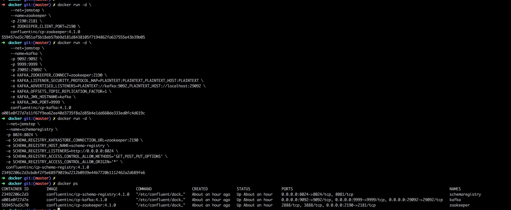


###### 6. Run App(steps to be done using console 3)

1. `git clone https://github.com/jemstep/analytics.git`
2. `cd analytics`
2. `sbt test`
3. `sbt "runMain com.jemstep.producer.PlainSinkProducerMain"`

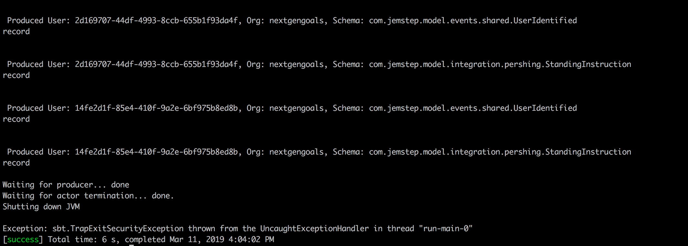

###### 7. Go to console 1 and 

1. run `./supervisor.sh` which registers kafka-indexing service with the coordinator.
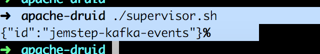

###### 8. Go to console 3 and 

1. run `sbt "runMain com.jemstep.producer.PlainSinkProducerMain"` to genarate more messages
2. run `sbt "runMain com.jemstep.producer.PlainSinkProducerMain"` to genarate more messages

###### 9. Below things can be seen in Druid console and Druid Indexing.

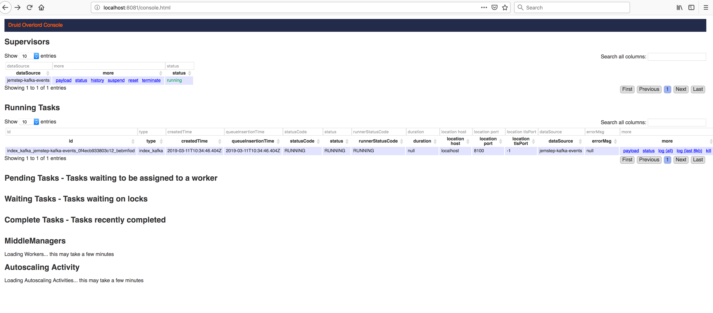
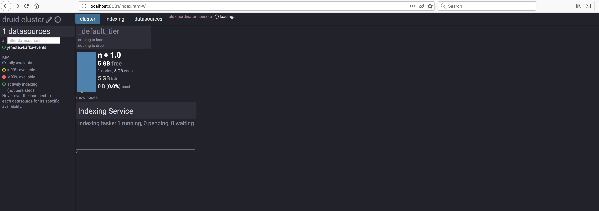
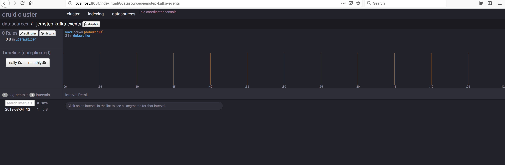
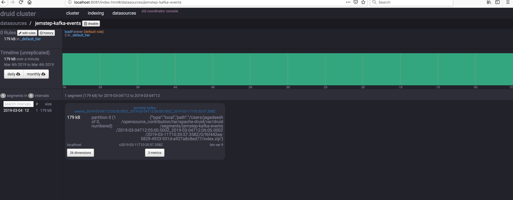
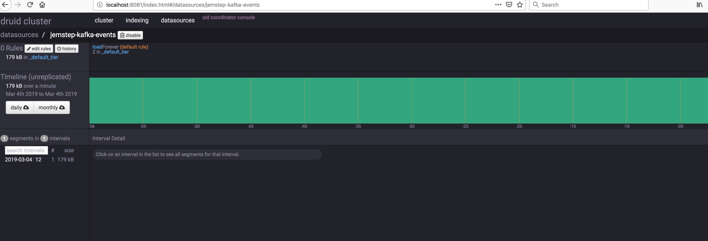
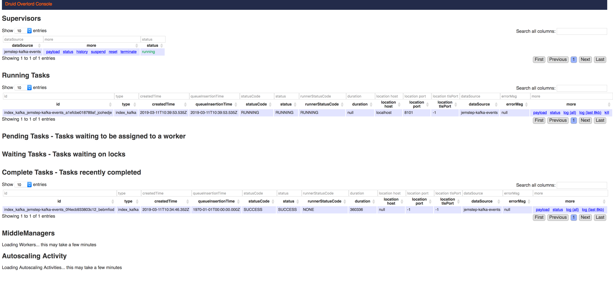
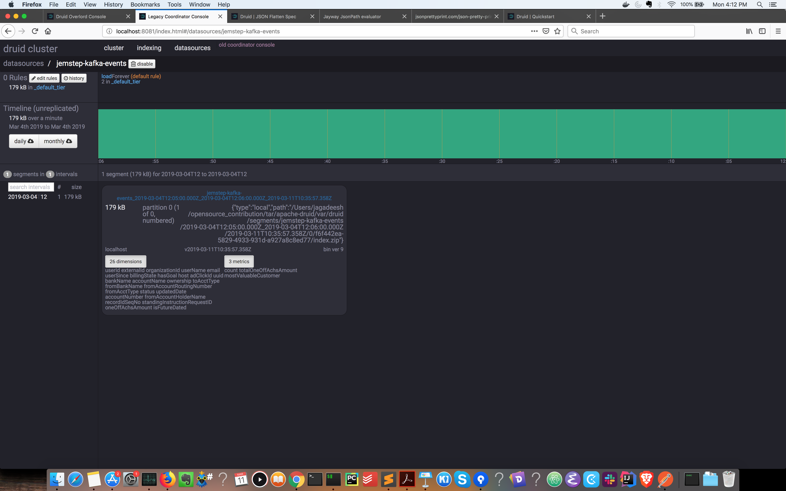
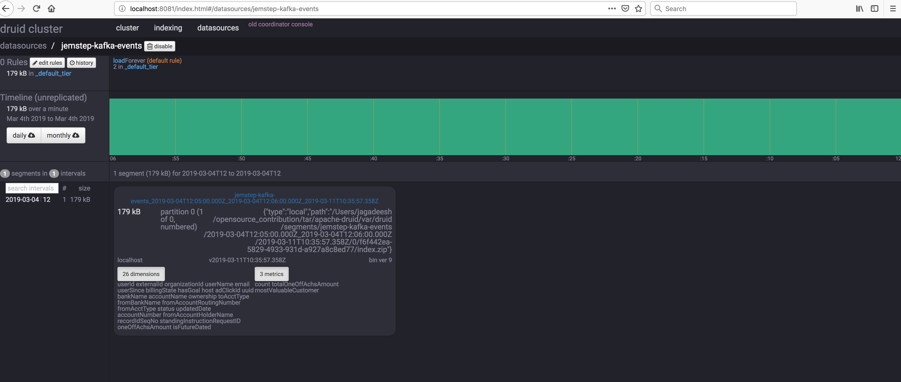
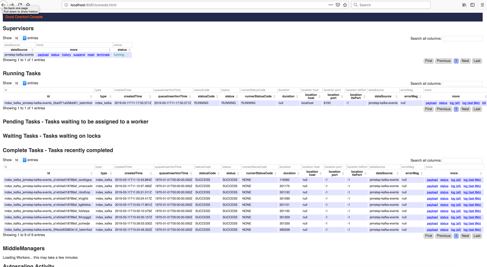

###### 10. Running SuperSet(open console 4)
```
git clone https://github.com/apache/incubator-superset/
cd incubator-superset/contrib/docker
# prefix with SUPERSET_LOAD_EXAMPLES=yes to load examples:
docker-compose run --rm superset ./docker-init.sh
# you can run this command everytime you need to start superset now:
docker-compose up
```

Steps already mentioned here: https://superset.incubator.apache.org/installation.html#start-with-docker

Once all of them are up you see below screenshots on console 4:
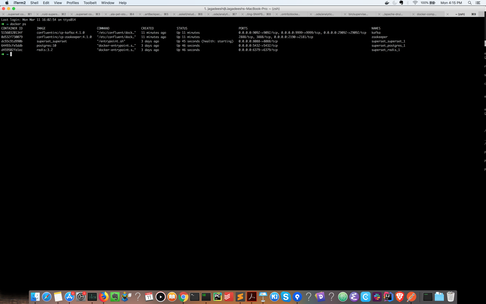
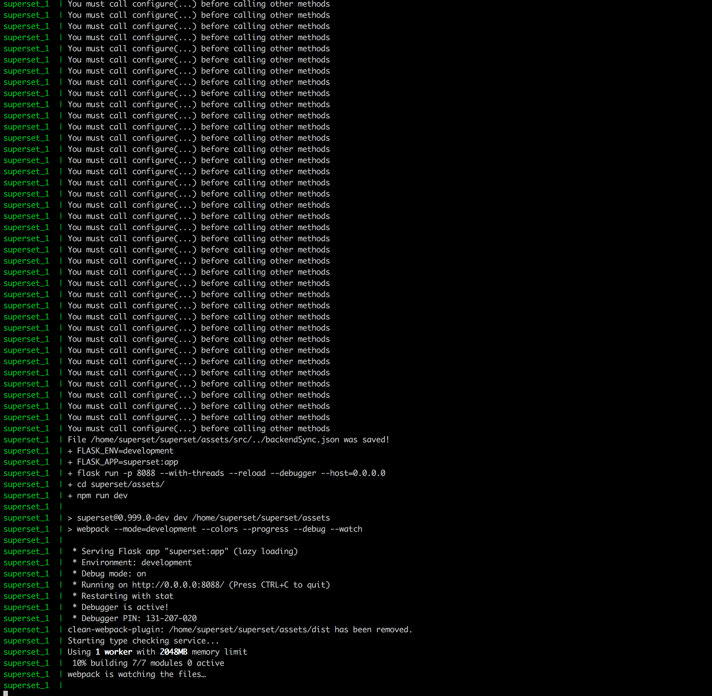

######: 11. Once superset starts running on http://localhost:8088, kindly follow
1. + https://github.com/jemstep/analytics/Step_by_step_Guide_To_configure_Superset.pdf document to connect to local druid broker for issuing quaries and creating charts with the data stored in Druid.

######: 12. More links useful during learning:
1. http://druid.io/docs/latest/design/index.html
2. http://druid.io/docs/latest/ingestion/flatten-json.html
3. http://jsonpath.herokuapp.com/
4. http://druid.io/docs/latest/ingestion/ingestion-spec.html
5. http://druid.io/docs/latest/querying/filters.html#javascript-filter
6. http://druid.io/docs/latest/querying/aggregations.html#javascript-aggregator
7. http://druid.io/docs/latest/design/segments.html
8. http://druid.io/docs/latest/ingestion/index.html


